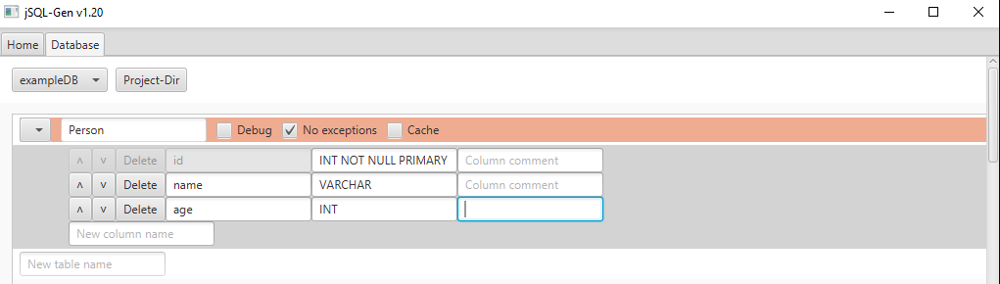

# jSQL-Gen
Java SQL (JDBC) code generator with GUI. Removes 100% of the boilerplate code and makes
it possible to use SQL databases without writing one line of SQL (compile-safe SQL).


## Usage
1. Install the latest [release](https://github.com/Osiris-Team/jSQL-Gen/releases/tag/latest). 
    - </img> Windows: Download the .exe installer file (anti-virus might flag it since its not signed, upload to [virustotal.com](https://www.virustotal.com/) if you want certainty).
    - </img>
    </img> Other platforms: Make sure you have [latest Java](https://www.oracle.com/java/technologies/downloads/)
      installed, then download the large .jar file and double-click it (if that doesn't work, open a terminal and run `java -jar NAME.jar`).
2. Create a database, tables and their columns via the GUI. 
3. Press `Generate Code` and add the code to your project.
4. Open `Database.java`, fill in your database credentials, and run your app.

<p>
<sub>
*Select a project directory to directly generate the code in there.
**Instead of inserting raw, readable credentials you can provide functions that fetch
those from a file. 
***Its expected that you have a database specific SQL driver in your projects like
<a href="https://github.com/mysql/mysql-connector-j">mysql-connector-j</a> for example.
</sub>
</p>

## Example
<p><b>I want to have a table named Person with the fields id, name and age. So I create it with the jSQL-Gen GUI and copy
the generated code into my project. Then I can do the following:</b></p>



```java
// The first time you use Person, the database, Person table 
// and its columns (and missing columns) will be created if needed.

// Inserting rows:
Person john = Person.create("John", 34); // id, name, age (id gets automatically set and incremented inside create())
Person.add(john); // Or: john.add();
Person.createAndAdd("John", 34); // The shorter variant

// Updating existing rows:
john.age = 36;
Person.update(john); // Or: john.update();

// Getting rows:
List<Person> all = Person.get(); // Gets all rows.
List<Person> allNamedJohn = Person.whereName().is("John").get(); // Gets all rows where the name equals "John"
List<Person> allNamedJohn2 = Person.get("WHERE name=?", "John"); // Sames as above, but with regular SQL
// Lazily get rows:
Person.getLazy(results -> { // List with 1000 persons
  // Executed once every 1000 persons until all data is retrieved
}, totalCount -> {
  // Executed when finished
}, 1000); // Limit for each request 

// Deleting rows:
Person.remove(john); // Or: john.remove();
Person.whereName().is("John").remove(); // Removes all rows where the name equals "John"
```

## Overview

### ⚡️ Low code ⚡️ Bug and SQL safety ⚡️ Powerful API
Fast development and prototyping due to 0% boilerplate and developer friendly API.
Compile-/Typesafe SQL queries via WHERE class.
Extensive utility methods, like fetching results lazily, DB reflection and much more (see "Features" for a complete list).

#### How does it work?
Generates one class for each table.
The generated class contains static methods like get(), add(), update(), remove() etc. to interact with the table.
Each instance/object of the class represents
one row and has public fields like obj.id obj.name etc. that can be changed.

#### Why should I use this?
If you used the default JDBC API at least once you will know why.
Just reading the "Safety" section below will already give you an idea.

## Features

### 🛡 Safety
- Secured against SQL-Injection by using prepared statements.
- Protection against timed out connections.
- 0% boilerplate and simple code decreasing the risk for bugs.
- (Optional) Helper WHERE class for generating simple and complex SQL queries, from compile-safe functions.
- Safe removal of rows where references will be unset (set to -1) by default. Also provides removeRefs(...) to safely remove referenced rows. References are created by naming your column like so: tableNameId.

### ⚡️ Performance
- No runtime overhead for class generation (unlike other ORMs).
- Cached connection pool ensures optimal performance on small and huge databases.
  Besides that it provides protection against timed out connections.
- (Optional) Cached results for ultra-fast data retrieval
  (cache gets cleared after INSERT/UPDATE/DELETE operations and is
  simply a map with SQL statements mapped to their results lists).

### 🛠 Customization
- Generated classes can be enhanced by adding your own custom code at the bottom of the class.
- Name your tables/columns however you like since internally names are encapsulated in backticks.
- You can add/rename/delete tables and columns (also change types/definitions) whenever you want,
since each time you press "Generate Files", change details between the current and last version are generated
(if there were any) and via an additional table with
table metadata jSQL-Gen keeps track of the actual tables state/version. Keep in mind that manual changes
to the database directly could result in issues.

### 🗄 SQL & JDBC
- The generated SQL code should be compatible with all types of SQL databases.
- The generated Java (and JDBC) code does not require any third party libraries and should work with Java 8 or higher.
- Supports all JDBC data types + some extras like enum. 
- `NULL` is not allowed, instead use the `DEFAULT ''` keyword.
- Supports DEFAULT for blobs. Example: `file BLOB DEFAULT ''`.
- Supports SQL DEFAULT for `NOW(), CURDATE(), CURTIME()`.

### ✴️ Other
- Simple UI to design databases within minutes.
- Autosuggestions for field definitions.
- Database structure/design as JSON file.
- Easily use multiple databases in a single project.
- (Optional) Supports generating Vaadin Flow Form to create/update/delete each object/row.
- The Vaadin Flow form also supports references to other tables (your field must be named `<table>Id` for example `personId`), meaning it will create a ComboBox that displays the object/row as string instead of only the id
which also contains all the rows of that table and allows the user to change it.
- DB "Reflection", meaning you can loop through table names, their columns, definitions and
even execute get/add/update/delete. Provided in the generated Database class.

### 🔴 Cons / Todo
PRs for these issues are greatly appreciated (sorted from most important, to least important).
- You need to know a bit of SQL, especially about definitions and defaults. This could be fixed by simplifying the GUI further.
- Internally a `idCounter` is used for each table, meaning if rows are added by another program the counter won't be accurate anymore and thus further insert operations will fail.
- Java Code Generator: No support for `FOREIGN KEY` / references between tables.
- Java Code Generator: No support for `VIEW, JOIN, UNION` / merged tables/results. This might never get fixed if its not possible to create a developer-friendly / simple API for this.

## Tipps
- You can select a project directory to directly generate the code in there. The generated code/files can also be found in the `generated` folder (press `Show Data` on the first tab, to open the location).
- Its possible to add additional Java code at the bottom of each generated class (only works when a project directory was selected).
- Its recommended to name your tables like you name your regular
Java objects, and your columns like your objects' fields.
- You can rename/refactor generated Java classes and their fields/methods etc., but keep
in mind that those changes won't affect the actual database tables/columns.
- Thus changes to the database (specially changes in data types) should be made using the GUI.
- When dealing with big amounts of data its recommended to use the WHERE class to its full extend to avoid going out of memory
or use the lazy loading methods.
- Make sure that all NOT NULL fields are on the upper half of the fields and the rest below. The generated functions will make more sense and will
be generally less error prone.
- If you want a list of items as a field or mappings between tables, create a new table named something like `PersonAndOrder` add fields for personId and orderId, and optionally any additional fields that are relevant for that relation.


Logos provided by [icons8.com](https://icons8.com/icons/).
